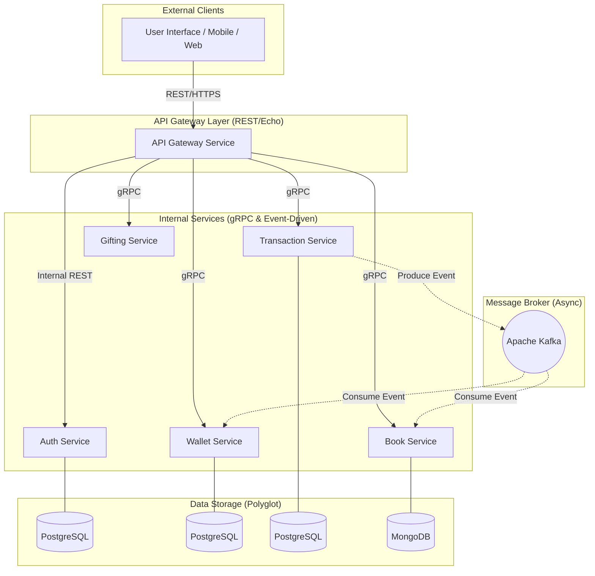

# 📚 Booktopia: Enterprise-Grade Microservices E-commerce Platform

<p align="center">
  <strong>A high-performance distributive system built for modern book commerce</strong><br>
  Engineered with Go, gRPC, Apache Kafka, and Polyglot Persistence
</p>

<p align="center">
  
  
  
  
  
  
</p>

---

## 📝 Overview

**Booktopia** is a state-of-the-art e-commerce platform designed with a **Microservices Architecture**. It addresses the complexities of modern digital marketplaces by decoupling core functionalities into independent, resilient services. 

The platform excels in distributed system orchestration, utilizing **gRPC** for low-latency internal communication and **Apache Kafka** for asynchronous, event-driven transaction processing.

---

## 🏗️ System Architecture

Booktopia leverages a sophisticated hybrid communication model: **REST API** for external client interaction via an API Gateway, and **gRPC** for high-performance internal service mesh communication.



---

## 📦 Service Ecosystem

| Service | Technology | Core Responsibility |
| :--- | :--- | :--- |
| **Gateway** | Echo, REST, JWT | The entry point. Handles routing, authentication check, and REST-to-gRPC translation. |
| **Auth** | Echo, PostgreSQL, GORM | Manages identity, RBAC (Admin/User), and notifications via Mailtrap integration. |
| **Book** | Echo, MongoDB | High-availability catalog management using document-based storage for flexible schemas. |
| **Wallet** | gRPC, PostgreSQL | Financial core. Handles atomic balance operations (Top-up, Debit, Credit). |
| **Transaction** | gRPC, Kafka, Postgres | Orchestrates purchase flows asinkron to ensure system resilience and consistency. |
| **Gifting** | gRPC, PostgreSQL | Social layer enabling book donations and digital gifts with automated expiry (Cron). |

---

## ✨ Engineering Highlights

- **🚀 Hybrid Communication**: Combines the ubiquity of **REST/JSON** with the extreme efficiency of **gRPC/Protobuf**.
- **⚡ Event-Driven Resilience**: Utilizes **Apache Kafka** to decouple Transaction processing from Inventory and Wallet updates, ensuring zero data loss.
- **🛡️ JWT & RBAC**: Implementation of secure, stateless authentication with fine-grained Role-Based Access Control.
- **📊 Polyglot Persistence**: Strategic choice of **PostgreSQL** for transactional integrity and **MongoDB** for highly-scalable product catalogs.
- **🐳 DevOps Ready**: Fully containerized environment using **Docker Compose** for seamless local and cloud deployment.
- **📈 Advanced Clean Architecture**: Each service follows the **Handler-Service-Repository** pattern for maximum testability.

---

## 🚀 Installation & Local Development

### Prerequisites
- **Go** v1.22+
- **Docker & Docker Compose**
- **Git**

### 1. Setup Environment

Clone the repository and initialize the Go workspace:

```bash
git clone https://github.com/ftryyln/final-project-h8-booktopia.git
cd final-project-h8-booktopia
go work init ./auth-service ./book-service ./gateway-service ./transaction-service ./wallet-service ./gifting-service
```

### 2. Infrastructure Setup
Start the required infrastructure (Kafka, Zookeeper) using Docker:

```bash
docker-compose up -d
```

### 3. Database Initialization
Ensure PostgreSQL and MongoDB are running. Import the initial schema:
```bash
mysql -u your_user -p < book-store.sql
```

### 4. Running Services
Each service can be launched from the root using `go run`:

```bash
# Recommended: Run in 6 separate terminal windows
go run ./auth-service/cmd/main.go
go run ./book-service/cmd/main.go
go run ./wallet-service/cmd/main.go
go run ./transaction-service/cmd/main.go
go run ./gifting-service/cmd/main.go
go run ./gateway-service/cmd/main.go
```

---

## 📡 API Documentation

Interactive Swagger documentation is generated automatically. 

👉 **Access Swagger UI**: [http://localhost:8000/swagger/index.html](http://localhost:8000/swagger/index.html) (Requires Gateway Service running)

---

## 🔬 Testing Strategy

The system prioritizes reliability with comprehensive unit testing:
```bash
# Example: Running tests in specific service
cd auth-service && go test ./... -v
```
- **Mocking**: Interface-based mocking for Service and Repository layers.
- **Async Testing**: Validation of Kafka message payloads.

---

## 👨‍💻 Authors

**BlackMarket Team:**
- [Fitry Yuliani](https://github.com/ftryyln)
- [Raihan](https://github.com/raihanpcr)

Developed as the **Final Project** for Hacktiv8 Fulltime Golang Program.

---

<p align="center">
  <strong>Mastering Distributed Systems. Simplifying Commerce. 🚀</strong>
</p>
